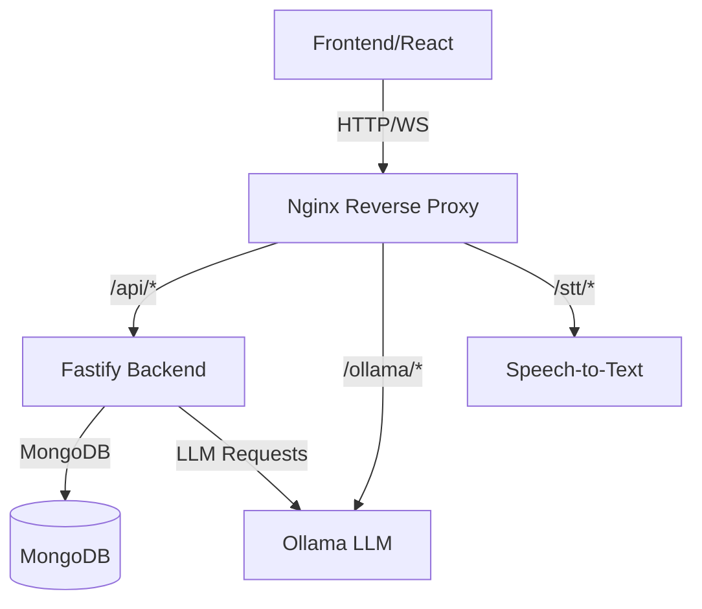

# Code Quality & Linting

This project enforces strict code quality and maintainability:
- All code is linted and auto-formatted using ESLint and Prettier
- Frontend: JavaScript/React (ESLint, Prettier, PropTypes)
- Backend: TypeScript (ESLint, Prettier, @typescript-eslint)
- All methods and variables should have meaningful comments
- No unused variables or functions in production code
- Code is reviewed for readability, maintainability, and accessibility

## Linting & Formatting Commands
```bash
# Frontend
cd frontend
npx eslint src/**/*.jsx --fix
npx prettier --write .

# Backend
cd backend
npx eslint src/**/*.ts --fix
npx prettier --write .
```

All contributions must follow these standards for acceptance.
# Documentation Guide

## Quick Reference

### Start Full Stack (Docker Compose)
```powershell
# Clone and enter repo
git clone https://github.com/bobbysingh2005/chat-localhost-llama3.git
cd chat-localhost-llama3

# Build frontend for nginx
cd frontend
npm install
npm run build
cd ..

# Start all services
docker compose up -d

# Access app at http://localhost:8000
```

### Architecture Overview



### Development Components

1. Frontend (React + Vite)
   - `frontend/src/views/chat.jsx`: Unified chat component
   - `frontend/src/views/App-setting.jsx`: App config/context
   - `frontend/src/views/auth.jsx`: Authentication
   - Uses JWT cookies + localStorage for guest mode

2. Backend (Fastify + TypeScript)
   - `backend/src/routes/generate.ts`: LLM proxy
   - `backend/src/routes/auth.ts`: User auth
   - `backend/src/routes/conversations.ts`: CRUD
   - MongoDB for persistence

3. Services
   - MongoDB: User/conversation storage (port 27018)
   - Ollama: LLM inference (port 11434)
   - STT: Speech recognition (port 2700)
   - Nginx: Reverse proxy (port 8000)

### Key URLs & Ports

Production (via nginx):
- Web UI: http://localhost:8000
- API: http://localhost:8000/api
- Ollama: http://localhost:8000/ollama
- STT: http://localhost:8000/stt

Development:
- Frontend: http://localhost:5173 (Vite)
- Backend: http://localhost:3000 (Fastify)
- MongoDB: localhost:27018
- Ollama: http://localhost:11434

### Environment Setup

Backend (`backend/.env`):
```env
NODE_ENV=development
PORT=3000
MONGO_URL=mongodb://localhost:27018/chatApp
OLLAMA_HOST=http://localhost:11434
SECRET_KEY=your_jwt_secret
```

Frontend (`frontend/.env`):
```env
VITE_API_URL=http://localhost:3000
```

### Docker Services

Key compose services:
```yaml
services:
  mongo:
    image: mongo:8
    ports: ["27018:27017"]
    volumes: ["./dump:/dump", "mongo_data:/data/db"]

  backend:
    build: ./backend
    ports: ["3000:3000"]
    depends_on: ["mongo"]

  ollama:
    image: ollama/ollama:rocm
    ports: ["11434:11434"]
    volumes: ["./models:/root/.ollama"]

  nginx:
    image: nginx:stable
    ports: ["8000:80"]
    volumes:
      - ./frontend/dist:/usr/share/nginx/html
      - ./nginx/nginx.conf:/etc/nginx/nginx.conf
```

### API Routes

Authentication:
- POST `/auth/register` - Create account
- POST `/auth/login` - Get JWT cookie
- GET `/auth/me` - Current user
- POST `/auth/logout` - Clear session

Chat/LLM:
- POST `/api/generate`
  ```json
  {
    "model": "llama3.2",
    "prompt": "message",
    "stream": true,
    "system": "optional"
  }
  ```

Conversations:
- GET `/api/conversations`
- POST `/api/conversations`
- GET `/api/conversations/:id`
- PUT `/api/conversations/:id` 
- DELETE `/api/conversations/:id`

### Development Commands

Frontend:
```bash
cd frontend
npm install
npm run dev     # start dev
npm run build   # build for nginx
```

Backend:
```bash
cd backend
npm install
npm run dev     # start dev (nodemon)
npm run build   # build TypeScript
npm start       # run built version
```

Docker:
```bash
# Start all
docker compose up -d

# Start deps only
docker compose up -d mongo ollama stt

# Logs
docker compose logs -f backend

# Stop all
docker compose down
```

### Testing

Health check:
```bash
curl http://localhost:8000/api/health
```

Generate test:
```bash
curl -X POST http://localhost:8000/api/generate \
  -H "Content-Type: application/json" \
  -d '{"model":"llama3.2","prompt":"hello","stream":false}'
```

### Common Issues

1. MongoDB connection:
   - Check `MONGO_URL` matches compose port (27018)
   - Verify container: `docker compose ps mongo`

2. Ollama errors:
   - Ensure model pulled: `docker exec -it ollama ollama pull llama3`
   - Check logs: `docker compose logs ollama`

3. Frontend 404s:
   - Rebuild: `cd frontend && npm run build`
   - Check nginx mount: `docker compose exec nginx ls /usr/share/nginx/html`

### Security Notes

1. JWT stored in HttpOnly cookies
2. CORS configured for:
   - Development: http://localhost:5173
   - Production: nginx origin

3. Rate limiting on:
   - Auth endpoints
   - Generate requests

4. Input validation:
   - Required fields
   - String lengths
   - JSON schema validation
